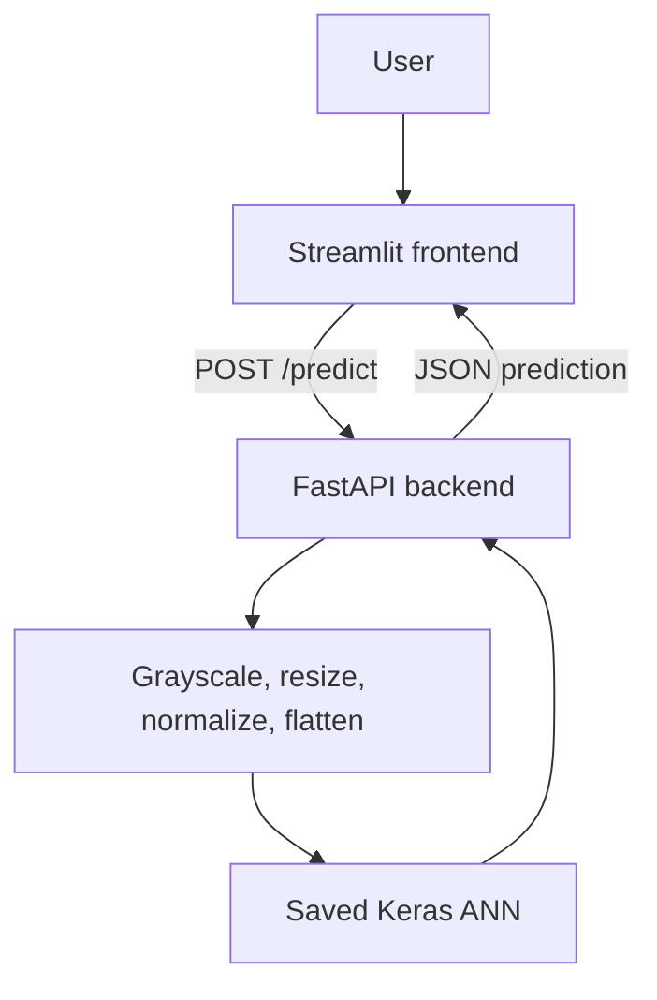

# MNIST ANN Handwritten Digit Classifier

A complete learning project that classifies handwritten digits with a fully connected Artificial Neural Network (ANN). A Streamlit frontend sends uploaded images over HTTP to a FastAPI backend, which preprocesses the image and returns the model's prediction and all ten class probabilities.

## Project Overview

MNIST contains grayscale images of handwritten digits from 0 through 9. This project intentionally uses an ANN rather than a CNN so the fundamentals of normalization, flattening, dense layers, training, evaluation, persistence, and serving remain visible. The model turns each 28 x 28 image into 784 input features because $28 x 28 = 784$.

## Architecture



## Machine Learning Workflow

Dataset -> preprocessing -> normalization -> flattening -> ANN -> training -> evaluation -> saved model -> prediction.

MNIST provides 60,000 training images and 10,000 test images. Each image is 28 x 28 pixels, grayscale, with one of 10 labels.

## Dataset

MNIST is downloaded automatically through TensorFlow/Keras when training or evaluation first runs. The dataset is not committed to this repository.

## Preprocessing

Training images are converted to `float32`, scaled from `[0, 255]` to `[0, 1]`, and flattened to 784 features. Uploaded images are converted to grayscale, resized to 28 x 28, inverted when necessary, normalized, flattened, and given a batch dimension of `(1, 784)`.

## Why ANN Instead of CNN?

This project uses an ANN to make normalization, flattening, dense layers, training, evaluation, persistence, and serving easy to study. CNNs generally preserve spatial relationships better and would normally be the stronger production choice for image classification.

## ANN Architecture

| Layer | Output | Activation |
|---|---:|---|
| Input | 784 | None |
| Dense | 128 | ReLU |
| Dense | 64 | ReLU |
| Output | 10 | Softmax |

## Technologies

Python, TensorFlow/Keras, NumPy, Pandas, Matplotlib, scikit-learn, Pillow, FastAPI, Uvicorn, Streamlit, Requests, and Pytest.

## Project Structure

- `src/`: dataset loading, preprocessing, model, training, evaluation, and prediction logic.
- `backend/`: FastAPI application, schemas, and uploaded-image preprocessing.
- `frontend/`: Streamlit application.
- `tests/`: preprocessing, model, and API tests.
- `models/`: saved `mnist_ann.keras` model.
- `artifacts/`: evaluation visualizations.
- `notebooks/`: beginner-friendly exploration notebook.
- `data/`: notes about automatic dataset downloads.

## How This Project Was Built

This section explains the complete build process so a new reader can understand both what was created and why it exists.

### 1. Create The Project Folders

The project was organized into separate folders so each responsibility has a clear home:

```powershell
mkdir mnist-ann-project
cd mnist-ann-project
mkdir src, backend, frontend, tests, models, artifacts, data, notebooks
```

- `src/` contains the machine-learning code.
- `backend/` exposes the trained model through HTTP.
- `frontend/` provides the user interface.
- `tests/` checks behavior automatically.
- `models/` stores the trained Keras model.
- `artifacts/` stores evaluation outputs such as the confusion matrix.
- `data/` documents downloaded datasets.
- `notebooks/` contains exploratory learning work.

### 2. Create The Virtual Environment

A virtual environment keeps this project's packages separate from other Python projects:

```powershell
python -m venv .venv
.\.venv\Scripts\Activate.ps1
```

The project uses Python 3.13 because TensorFlow 2.20 does not provide a compatible wheel for Python 3.14. The repository includes `runtime.txt` for the backend deployment.

### 3. Install Dependencies

All runtime and development packages are declared in `requirements.txt`:

```powershell
python -m pip install -r requirements.txt
```

TensorFlow is conditional on Python being below 3.14 because the Streamlit frontend only calls the backend and does not need TensorFlow itself.

### 4. Load And Prepare MNIST

`src/data_loader.py` downloads MNIST through Keras and calls the reusable functions in `src/preprocessing.py`. The preprocessing code converts pixels to `float32`, normalizes values from `[0, 255]` to `[0, 1]`, and flattens every 28 x 28 image into 784 features.

### 5. Build The ANN

`src/model.py` defines and compiles the dense neural network:

```text
784 input features -> Dense(128, ReLU) -> Dense(64, ReLU) -> Dense(10, Softmax)
```

The final Softmax layer produces one probability for each digit from 0 through 9.

### 6. Train And Save The Model

`src/train.py` trains the model with Adam, validation data, and early stopping. It evaluates the test set and saves the result so the API does not retrain on every request:

```powershell
python -m src.train --epochs 10
```

Output model:

```text
models/mnist_ann.keras
```

### 7. Evaluate The Model

`src/evaluate.py` loads the saved model, prints test metrics and a classification report, and creates a confusion matrix:

```powershell
python -m src.evaluate
```

Output artifact:

```text
artifacts/confusion_matrix.png
```

### 8. Add Prediction Utilities

`src/predict.py` centralizes model loading and prediction. It returns the selected digit, its confidence, and all ten class probabilities. The model path is calculated from the source file location, so it works even when the server is started from another working directory.

### 9. Build The FastAPI Backend

`backend/preprocessing.py` prepares uploaded PNG, JPG, JPEG, and WebP files by converting them to grayscale, resizing to 28 x 28, correcting light backgrounds, normalizing pixels, flattening them, and adding the batch dimension `(1, 784)`.

`backend/main.py` loads the model once during application startup and provides these endpoints:

```text
GET  /        API information
GET  /health  health status
POST /predict image upload and prediction response
```

Start it locally with:

```powershell
uvicorn backend.main:app --reload
```

### 10. Build The Streamlit Frontend

`frontend/streamlit_app.py` lets a user upload a digit image, previews it, sends it to `/predict`, and displays the predicted digit, confidence, and probability chart. The frontend reads `BACKEND_URL` from Streamlit Secrets first, then from the environment, and finally uses the local backend default.

Local command:

```powershell
streamlit run frontend/streamlit_app.py
```

For Streamlit Cloud, add this under the app's Secrets settings:

```toml
BACKEND_URL = "https://mnist-ann-project-1.onrender.com"
```

### 11. Add Automated Tests

The tests verify preprocessing output, ANN input and output behavior, API health, valid image predictions, and invalid file handling:

```powershell
pytest -q
```

### 12. Publish And Deploy

The project was committed to Git and pushed to GitHub:

```powershell
git add .
git commit -m "Complete end-to-end MNIST ANN application"
git push
```

The backend is deployed on Render with:

```text
Build command: pip install -r requirements.txt
Start command: uvicorn backend.main:app --host 0.0.0.0 --port $PORT
Health path: /health
```

The frontend is deployed on Streamlit Community Cloud using `frontend/streamlit_app.py`. The frontend and backend are separate services and communicate through the `BACKEND_URL` setting.

## Installation

```powershell
git clone <repository-url>
cd mnist-ann-project
python -m venv .venv
.\.venv\Scripts\Activate.ps1
python -m pip install -r requirements.txt
```

The dataset downloads automatically through TensorFlow/Keras when training or evaluation first runs. No dataset or secret is required in the repository.

## Virtual Environment

Create and activate the project-local `.venv` before installing dependencies or running project commands.

## Training

```powershell
python -m src.train --epochs 10
```

This saves the model to `models/mnist_ann.keras` and prints training, validation, and test metrics.

## Evaluation

```powershell
python -m src.evaluate
```

The command prints a classification report and saves `artifacts/confusion_matrix.png`.

## Running Backend

```powershell
uvicorn backend.main:app --reload
```

For Render or another process-based host:

```text
uvicorn backend.main:app --host 0.0.0.0 --port $PORT
```

## API Endpoints

- `GET /`: basic API message.
- `GET /health`: service health status.
- `POST /predict`: multipart image upload returning `predicted_digit`, `confidence`, and probabilities for digits 0 through 9.

## API Documentation

Interactive Swagger documentation is available at `http://127.0.0.1:8000/docs`; ReDoc is at `/redoc`.

## Running Frontend

In a second terminal with the virtual environment activated:

```powershell
streamlit run frontend/streamlit_app.py
```

## Environment Variables

The frontend uses `BACKEND_URL`, defaulting to `http://127.0.0.1:8000`. Set it before launching when the backend is deployed:

```powershell
$env:BACKEND_URL = "https://your-backend.example.com"
streamlit run frontend/streamlit_app.py
```

The frontend and backend communicate through HTTP; the frontend does not import backend code.

## Testing

After training the model, run:

```powershell
pytest -q
```

Tests cover preprocessing shape and scale, model input/output behavior, API health, valid prediction uploads, and invalid file handling.

## Deployment

The backend and frontend are designed to deploy separately. Provide the deployed backend URL as `BACKEND_URL` to Streamlit Community Cloud. The documented Uvicorn command is suitable for Render-style services. Deployment is not claimed as complete by this repository.

## Live Demo

Frontend: To be deployed

Backend API: To be deployed

## Limitations

The ANN ignores much of the spatial structure in images, so a CNN would normally be a better production choice. Uploaded photos can also differ from the centered, standardized MNIST examples.

## Future Improvements

- Add a CNN comparison.
- Add optional drawing support.
- Improve image centering and digit cropping.
- Add Docker and CI/CD.
- Add model versioning and richer confidence visualizations.

## Learning Outcomes

This project demonstrates dataset handling, reusable preprocessing, dense neural-network design, model training, evaluation, saving/loading, API design, frontend/backend separation, automated testing, and deployment-oriented configuration.

## License

MIT
